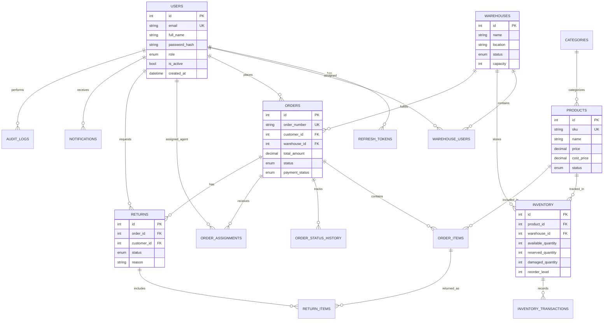

# Entity Relationship Diagram (Mermaid)

```mermaid
erDiagram
    USERS ||--o{ REFRESH_TOKENS : has
    USERS ||--o{ WAREHOUSE_USERS : assigned
    USERS ||--o{ ORDERS : places
    USERS ||--o{ ORDER_ASSIGNMENTS : assigned_agent
    USERS ||--o{ RETURNS : requests
    USERS ||--o{ NOTIFICATIONS : receives
    USERS ||--o{ AUDIT_LOGS : performs

    WAREHOUSES ||--o{ WAREHOUSE_USERS : contains
    WAREHOUSES ||--o{ INVENTORY : stores
    WAREHOUSES ||--o{ ORDERS : fulfills

    PRODUCTS ||--o{ INVENTORY : tracked_in
    PRODUCTS ||--o{ ORDER_ITEMS : included_in
    CATEGORIES ||--o{ PRODUCTS : categorizes

    INVENTORY ||--o{ INVENTORY_TRANSACTIONS : records

    ORDERS ||--o{ ORDER_ITEMS : contains
    ORDERS ||--o{ ORDER_STATUS_HISTORY : tracks
    ORDERS ||--o{ ORDER_ASSIGNMENTS : receives
    ORDERS ||--o{ RETURNS : has

    RETURNS ||--o{ RETURN_ITEMS : includes
    ORDER_ITEMS ||--o{ RETURN_ITEMS : returned_as

    USERS {
        int id PK
        string email UK
        string full_name
        string password_hash
        enum role
        bool is_active
        datetime created_at
    }

    WAREHOUSES {
        int id PK
        string name
        string location
        enum status
        int capacity
    }

    PRODUCTS {
        int id PK
        string sku UK
        string name
        decimal price
        decimal cost_price
        enum status
    }

    INVENTORY {
        int id PK
        int product_id FK
        int warehouse_id FK
        int available_quantity
        int reserved_quantity
        int damaged_quantity
        int reorder_level
    }

    ORDERS {
        int id PK
        string order_number UK
        int customer_id FK
        int warehouse_id FK
        decimal total_amount
        enum status
        enum payment_status
    }

    RETURNS {
        int id PK
        int order_id FK
        int customer_id FK
        enum status
        string reason
    }
```
